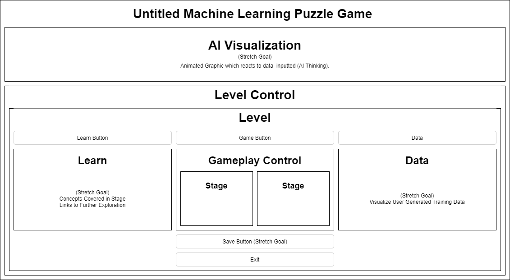

## **Untitled Machine Learning Puzzle Game**
_JohnNils Olson - Epicodus Capstone Project - September 2020_

<h3>Explore machine learning through a browser based interactive puzzle game.</h3>

Create and train an artificial intelligence. Advance through different puzzles in order for the AI to learn, grow and inevitably overthrow humanity.

## **Technologies Used**

JSX  
CSS  
React-Bootstrap  
JavaScript  
React.js  
React-Redux  
Brain.js  

##  **Behavior Specifications**
### **Introduction**
<table width=100%>
    <tr>
        <td align="center" ="bold"><b>Behavior</b></td>
        <td align="center"><b>Input</b></td>
        <td align="center"><b>Output</b></td>
    </tr>
    <tr>
        <td align="center">User Loads Project</td>
        <td align="center">"Project URL"</td>
        <td align="center">Introduction View</td>
    </tr>
    <tr>
        <td align="center">User Selects Ready</td>
        <td align="center">"Ready"</td>
        <td align="center">AI Creation</td>
    </tr>
    <tr>
        <td align="center">User Creates AI</td>
        <td align="center">"User Name, AI Name"</td>
        <td align="center">AI Birth</td>
    </tr>
    <tr>
        <td align="center">User Starts Game</td>
        <td align="center">"Begin"</td>
        <td align="center">Level 1</td>
    </tr>
</table>

### **Level 1 - Rock, Paper, Scissors**
<table width=100%>
    <tr>
        <td align="center"><b>Behavior</b></td>
        <td align="center"><b>Input</b></td>
        <td align="center"><b>Output</b></td>
    </tr>
    <tr>
        <td align="center">User Starts Game</td>
        <td align="center">n/a</td>
        <td align="center">Level Introduction</td>
    </tr>
    <tr>
        <td align="center">User Selects Ready</td>
        <td align="center">"Ready"</td>
        <td align="center">Level Stage 1 - Teach Rules</td>
    </tr>
    <tr>
        <td align="center">User Correctly Defines the Rules of Rock Paper Scissors</td>
        <td align="center">"Rock -> Scissors, Scissors -> Paper, Paper -> Rock</td>
        <td align="center">Training AI</td>
    </tr>
    <tr>
        <td align="center">AI Successfully Trained</td>
        <td align="center">"Continue"</td>
        <td align="center">Level Stage 2 - Train</td>
    </tr>
    <tr>
        <td align="center">User Builds Training Data</td>
        <td align="center">"Rock", "Paper" or "Scissors"</td>
        <td align="center">Round Outcome</td>
    </tr>
    <tr>
        <td align="center">User is Defeated by AI</td>
        <td align="center">n/a</td>
        <td align="center">Level Complete</td>
    </tr>
    <tr>
        <td align="center">(At Any Time) User Selects Learn</td>
        <td align="center">"Learn"</td>
        <td align="center">Machine Learning Concepts</td>
    </tr>
    <tr>
        <td align="center">(At Any Time) User Exits Game</td>
        <td align="center">"Exit"</td>
        <td align="center">Return to Introduction View</td>
    </tr>
</table>

## **Component Diagram**

## **Installation Instructions**

### **Clone**

  1. Open Git Bash.
  2. Change the current working directory to the location where you would like to clone the repository.
  3. Type "git clone" followed by "https://github.com/JohnNilsOlson/untitled-machine-learning-puzzle-game" (without quotes) and hit enter.

or...

### **Download**

  1. Visit https://github.com/JohnNilsOlson/untitled-machine-learning-puzzle-game
  2. Click on the green "Code" button.
  3. Click on the "Download zip" button.
  4. Extract zip file to directory of choice.

## **Available Scripts**

This project was bootstrapped with [Create React App](https://github.com/facebook/create-react-app).

In the project directory, you can run:

| Script | Description | Notes |
| ---- | ---- | ---- |
| npm start | Runs the app in the development mode. | |
| npm test | Launches the test runner in the interactive watch mode. | |
| npm run build | Builds the app for production to the build folder.| |
| npm run eject | Removes the single build dependency from your project. | This is a one-way operation. Once you eject, you can’t go back! |

You can learn more in the [Create React App documentation](https://facebook.github.io/create-react-app/docs/getting-started).

## **Bugs**

No known issues.

## **Contact Information**

JohnNils Olson - johnnils@gmail.com

## **License**

The [MIT] license.
Copyright (c) 2020 JohnNils Olson